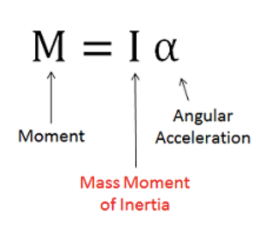
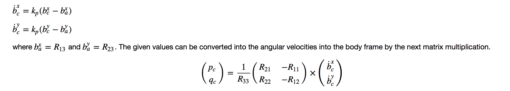
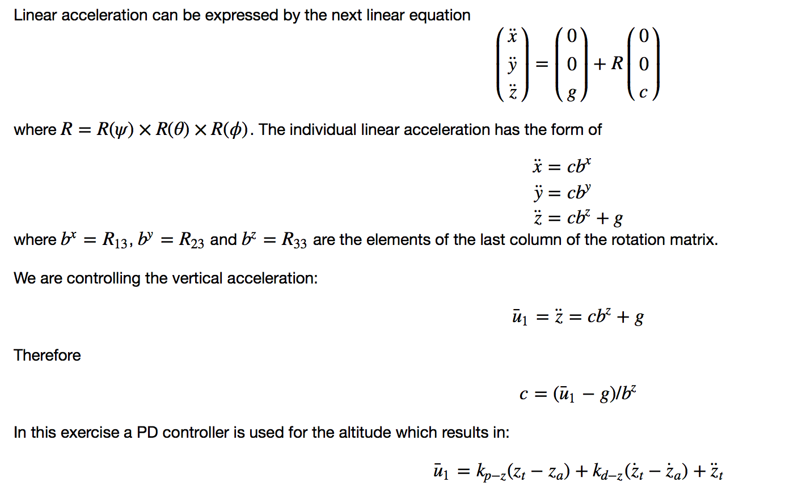
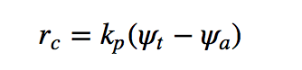

#Implemented body rate control in C++.

Body rate control can be achieved by body turning rate(pqr) along xyz axis also know for rotational velocity rates. The desired Rotational rate in the body frame can be controlled by using u_bar_(pqr)=KpPQR*(Commaned - actual) which gives us the acceleration along body frame in each direction which is then converted into momentum throught I * u_bar for each respective axis.

The body rate control is implemented as in QuadControl.cpp file from `line 92 to 120 using C++`.

#Implement roll pitch control in C++.
The roll-pitch controller is a P controller responsible for commanding the roll and pitch rates in this case it we will need to have return the roll pitch rate from given input as AccelCmd. Basic `F=M*A` will solve the accleration problem which is then divide by AccelCmd(X-axis and Y-axis) this yields out the `b_C_X_dot`(in code it's` b_x_P_term`).This can be then used in formulae.

The roll pitch control in C++ is implemented in QuadControl.cpp starting from **line 123 to 172
**
#Implement altitude controller in C++.
Altitude Controller is reponsible for collective Thrust and also to avoid the collision in the environment. Also z is placed as negative direction in the axis which is pointing down to the surface. In this case we are given input as desired vertical position and velocity, current vertical position and velocity and accelZCmd: feed-forward vertical acceleration. Now we can use `z_err` for position and them multiply with the kpPosZ to get poisiton value. Similarly we get `z_dot_err` which is then corrected with multiplying dt to matrix. Finally we find `u_1_bar = p_term+i_term+accelZcmd`. which is then subract with constant gravity. Hence `Thrust = mass * acc`

QuadControl::AltitudeControl method in QuadControl.cpp file has been used starting from **line 174 to 219**

#Implement lateral position control in C++.
The lateral controller will use a PD controller to command target values for elements of the drone's rotation matrix. The drone generates lateral acceleration by changing the body orientation which results in non-zero thrust in the desired direction. This will translate into the commanded rotation matrix elements bxc and byc. This can be represted as`accelCmd = kpPos * ( posCmd - pos ) + kpVel * ( capVelCmd - vel ) + accelCmd`
Handling accelaration is lateral plane is done here and also velocity generation. **Its done in line 222 to 277**

#Implement yaw control in python and C+
A P controller is used to control the YAW of the drone. In this case, we have an input as Yaw command and current yaw. Now we need to the desired Yaw Rate. we Use fmodf(x,y) method to determine the remainder when x is divided by y and then we determine the error value with is lastly multiplied by KpYAW to yield YawRateCmd.

The controller is been done with a linear/proportional heading controller to yaw rate commands. **It starts from line 280 to 312.**

#Implement calculating the motor commands given commanded thrust and moments in C++.

Firstly the Value of Lenght is calculate in this case it will not be L as Its the measurement from the drone rotor to it's perpendicular distance cos 45 from the axis. Now we will Calculate the all Forces using momentCMD divided by lenght for x and y. For Z we use kappa intead of L. Last Force would be CollThurstCmd from drone. Desired thust will be achived by calucation of above four equations which yields out Desired Thrust for each ROTOR.This can be shown in **line 56 to 90** in QuadControl.cpp file.